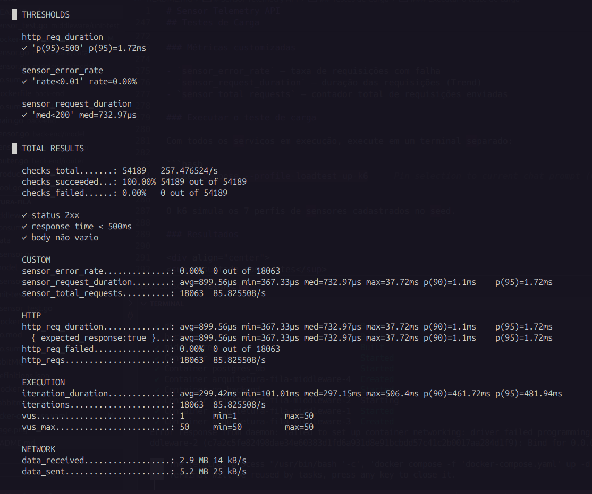

# Sensor Telemetry API

Sistema de ingestão de dados coletados por dispositivos embarcados industriais. O backend recebe leituras de sensores via HTTP e as encaminha para uma fila RabbitMQ, onde um consumidor as processa e persiste em um banco de dados PostgreSQL.

## Visão Geral

A aplicação resolve um desafio de escalabilidade no monitoramento industrial: dispositivos embarcados enviam leituras periódicas de sensores (temperatura, umidade, presença, vibração, luminosidade e nível de reservatórios). Para suportar o alto volume de requisições simultâneas sem gargalos, o endpoint apenas enfileira a mensagem e retorna imediatamente, enquanto um consumidor independente persiste os dados no banco.


## Arquitetura

```
┌─────────────────┐     HTTP POST       ┌─────────────────┐
│ Dispositivo     │ ─────────────────►  │   Backend Go    │
│ Embarcado       │                     │   (porta 8080)  │
└─────────────────┘                     └────────┬────────┘
                                                 │ AMQP Publish
                                                 ▼
                                        ┌─────────────────┐
                                        │     RabbitMQ    │
                                        │fila: SENSOR.DATA│
                                        │   (porta 5672)  │
                                        └────────┬────────┘
                                                 │ AMQP Consume
                                                 ▼
                                        ┌─────────────────┐
                                        │  Middleware Go  │
                                        │   (Consumidor)  │
                                        └────────┬────────┘
                                                 │ SQL Insert
                                                 ▼
                                        ┌─────────────────┐
                                        │   PostgreSQL    │
                                        │  (porta 5433)   │
                                        └─────────────────┘
```

O fluxo completo funciona da seguinte forma:

1. O dispositivo embarcado envia um `POST /sensorData` com os dados da leitura
2. O Backend valida o JSON e publica a mensagem na fila `SENSOR.DATA` do RabbitMQ
3. O Middleware consome as mensagens da fila e as persiste no PostgreSQL

## Estrutura do Projeto

```
.
├── back-end/                  # API HTTP (produtor RabbitMQ)
│   ├── handler/
│   │   └── sensor.go          # Handler dos endpoints HTTP
│   ├── messaging/
│   │   └── rabbitmq.go        # Publicação de mensagens no RabbitMQ
│   ├── model/
│   │   └── sensor.go          # Struct SensorMessage
│   ├── router/
│   │   └── router.go          # Configuração das rotas Gin
│   ├── main.go
│   ├── Dockerfile
│   ├── go.mod
│   └── go.sum
│
├── middleware/                # Consumidor RabbitMQ + persistência
│   ├── cmd/middleware/
│   │   └── main.go            # Ponto de entrada, conexões DB e RabbitMQ
│   ├── consumer/
│   │   └── consumer_job.go    # Loop de consumo
│   ├── data/
│   │   └── sensor.go          # Repositório PostgreSQL
│   ├── model/
│   │   └── sensor.go          # Struct SensorMessage
│   ├── unit-test/
│   │   └── sensor_test.go     # Testes unitários
│   ├── Dockerfile
│   ├── go.mod
│   └── go.sum
│
├── database/                  # PostgreSQL
│   ├── init/
│   │   └── init.sql           # Schema + seed de dados
│   └── Dockerfile
│
├── rabbitMQ/                  # RabbitMQ
│   ├── definitions.json       # Usuários, vhosts, permissões e fila pré-criada
│   ├── rabbitmq.conf          # Carrega definitions.json na inicialização
│   └── Dockerfile
│
├── load-test/                 # Teste de carga k6
│   ├── k6-test.ts             # Script TypeScript do k6
│   └── Dockerfile             # Build TypeScript + execução k6
│
└── docker-compose.yaml        # Orquestração de todos os serviços
```
## Modelo de Dados

O banco é estruturado para separar leituras analógicas (valores contínuos como temperatura) de discretas (valores inteiros como presença/ausência), permitindo otimizações de armazenamento e consulta distintas para cada tipo.

### Diagrama de Entidades

```
sensor_types                        devices
─────────────                       ─────────────────────
id   (PK)                           id          (PK UUID)
name (UNIQUE)                       serial      (UNIQUE)
unit                                description
                                    active
                                    created_at

analog_readings                     discrete_readings
──────────────────────────          ──────────────────────────
id           (PK BIGSERIAL)         id           (PK BIGSERIAL)
device_id    (FK → devices)         device_id    (FK → devices)
sensor_type_id (FK → sensor_types)  sensor_type_id (FK → sensor_types)
value        NUMERIC(10,4)          value        INTEGER
collected_at TIMESTAMPTZ            collected_at TIMESTAMPTZ
saved_at     TIMESTAMPTZ            saved_at     TIMESTAMPTZ
```

### Tipos de Sensores (seed)

| Nome | Unidade | Tipo de Leitura |
|---|---|---|
| temperatura | °C | analógica |
| umidade | % | analógica |
| presença | — | discreta (0/1) |
| vibração | mm/s | analógica |
| luminosidade | lux | analógica |
| nível_reservatório | % | analógica |

### Dispositivos Pré-cadastrados (seed)

| Serial | Descrição | Ativo |
|---|---|---|
| SN-TH-001 | Temperatura/Umidade — Sala de servidores A | [x] |
| SN-TH-002 | Temperatura/Umidade — Sala de servidores B | [x] |
| SN-PIR-001 | Presença PIR — Corredor principal | [x] |
| SN-VIB-001 | Vibração — Compressor #1 | [x] |
| SN-LUX-001 | Luminosidade — Área de produção | [x] |
| SN-NIV-001 | Nível — Reservatório de água tratada | [x] |
| SN-TH-003 | Temperatura — Câmara fria | [ ] |

## API

### `GET /`

Verifica se a API está no ar.

**Resposta `200 OK`:**
```json
{ "success": "API running" }
```

### `POST /sensorData`

Recebe uma leitura de sensor e a enfileira no RabbitMQ para processamento assíncrono.

**Headers:**
```
Content-Type: application/json
```

**Body:**
```json
{
  "idSensor":   "SN-TH-001",
  "timestamp":  "2024-06-01T12:00:00Z",
  "sensorType": "temperatura",
  "readType":   "analog",
  "value":      23.5
}
```

| Campo | Tipo | Descrição |
|---|---|---|
| `idSensor` | string | Serial do dispositivo (deve existir na tabela `devices`) |
| `timestamp` | string | Data/hora da coleta em formato RFC 3339 |
| `sensorType` | string | Tipo do sensor (deve existir na tabela `sensor_types`) |
| `readType` | string | `"analog"` ou `"discrete"` |
| `value` | number | Valor da leitura |

**Respostas:**

| Status | Descrição |
|---|---|
| `200 OK` | Mensagem enfileirada com sucesso |
| `400 Bad Request` | JSON inválido ou campos ausentes |
| `500 Internal Server Error` | Falha na conexão com o RabbitMQ |

**Resposta `200 OK`:**
```json
{ "success": "Message sent to queue" }
```

**Resposta `400 Bad Request`:**
```json
{ "error": "Invalid JSON" }
```

---

## Como Executar

### Pré-requisitos

- [Docker](https://docs.docker.com/get-docker/) instalado
- [Docker Compose](https://docs.docker.com/compose/install/) instalado

### 1. Subir todos os serviços

```bash
docker compose up --build
```

Os serviços estarão disponíveis em:

| Serviço | Endereço |
|---|---|
| API Backend | http://localhost:8080 |
| RabbitMQ Management UI | http://localhost:15672 (usuário: `admin`, senha: `admin`) |
| PostgreSQL | localhost:5433 (usuário: `admin`, senha: `admin`, banco: `database`) |

### 2. Testar o endpoint

```bash
curl -X POST http://localhost:8080/sensorData \
  -H "Content-Type: application/json" \
  -d '{
    "idSensor":   "SN-TH-001",
    "timestamp":  "2024-06-01T12:00:00Z",
    "sensorType": "temperatura",
    "readType":   "analog",
    "value":      23.5
  }'
```

### 3. Derrubar os serviços

```bash
docker compose down
```

Para remover volumes (apaga dados do banco e do RabbitMQ):

```bash
docker compose down -v
```

## Testes de Carga

O teste de carga é executado com **k6** dentro de um container Docker, simulando múltiplos dispositivos enviando leituras simultâneas ao backend.

### Cenário

O teste utiliza uma rampa progressiva de usuários virtuais (VUs):

```
VUs
50 │                    ████████████
   │                 ███            ███
10 │    █████████████                  
   │ ███                                ███
 0 └────────────────────────────────────────► tempo
     0s  30s    90s  120s         180s 210s
```

### Thresholds (critérios de sucesso)

| Métrica | Critério |
|---|---|
| `http_req_duration` (p95) | < 500ms |
| `sensor_error_rate` | < 1% |
| `sensor_request_duration` (mediana) | < 200ms |

### Métricas customizadas

- `sensor_error_rate` — taxa de requisições com falha
- `sensor_request_duration` — duração das requisições (Trend)
- `sensor_total_requests` — contador total de requisições enviadas

### Executar o teste de carga

Com todos os serviços em execução, execute em um terminal separado:

```bash
docker compose --profile loadtest up k6
```

O k6 simula os 7 perfis de sensores cadastrados no seed.

### Resultado de Teste de Carga — k6

#### Thresholds (Critérios de Aceitação)

| Threshold | Critério | Resultado | Status |
|---|---|---|---|
| `http_req_duration` p(95) | < 500ms | **1,72ms** | ✅ Aprovado |
| `sensor_error_rate` | < 1% | **0,00%** | ✅ Aprovado |
| `sensor_request_duration` mediana | < 200ms | **732,97µs** | ✅ Aprovado |

**Todos os thresholds foram aprovados.**

#### Checks (Validações por Requisição)

| Validação | Resultado |
|---|---|
| `status 2xx` | ✅ 100% |
| `response time < 500ms` | ✅ 100% |
| `body não vazio` | ✅ 100% |

- **checks_total:** 54.189 (3 checks × 18.063 requisições)
- **checks_succeeded:** 54.189 — **100,00%**
- **checks_failed:** 0 — **0,00%**

#### Métricas de Latência HTTP

| Métrica | Valor |
|---|---|
| Média (avg) | 899,56µs |
| Mínimo (min) | 367,33µs |
| Mediana (med) | 732,97µs |
| Máximo (max) | 37,72ms |
| Percentil 90 (p90) | 1,1ms |
| Percentil 95 (p95) | 1,72ms |

#### Métricas Customizadas

| Métrica | Valor |
|---|---|
| `sensor_error_rate` | 0,00% (0 erros em 18.063) |
| `sensor_request_duration` (avg) | 899,56µs |
| `sensor_request_duration` (med) | 732,97µs |
| `sensor_total_requests` | 18.063 |

#### Execução

| Métrica | Valor |
|---|---|
| Duração por iteração (avg) | 299,42ms |
| Duração por iteração (med) | 297,15ms |
| Duração por iteração (max) | 506,4ms |
| Duração por iteração (p95) | 481,94ms |
| Total de iterações | 18.063 |
| Throughput | 85,83 iterações/s |

#### Rede

| Métrica | Valor |
|---|---|
| Dados recebidos | 2,9 MB (14 kB/s) |
| Dados enviados | 5,2 MB (25 kB/s) |

<div align="center">
<sup>Resultado dos testes</sup>

<sup>Print dos resultados.</sup>
</div>

#### Conclusão

A arquitetura demonstrou alta escalabilidade e desempenho nos testes de carga. Com 50 usuários simultâneos por 210 segundos, o sistema manteve latência abaixo dos limites definidos, graças ao desacoplamento proporcionado pela fila de mensagens. Não houve falhas nas mais de 18 mil requisições, e o throughput permaneceu estável, sem sinais de saturação do backend. 

## Testes Unitários

Os testes unitários estão no módulo `middleware`, cobrindo a lógica de negócio sem dependências externas (banco de dados ou RabbitMQ).

### O que é testado

- Serialização e desserialização JSON do `SensorMessage`
- Validação dos campos `readType` (`analog` / `discrete`)
- Parsing de timestamps RFC 3339 (válidos e inválidos)
- Comportamento do repositório fake (`fakeRepo`)
- Lógica de `handleMessage` (parse → save → ack/nack)
- Processamento em lote (`SaveReadingsBatch`) e preservação de ordem
- Casos de borda: valores zero, negativos e muito grandes
- Geração de DSNs para PostgreSQL e RabbitMQ

### Executar os testes

```bash
cd middleware
go test ./unit-test/... -v
```

## Variáveis de Ambiente

| Variável | Padrão | Descrição |
|---|---|---|
| `DB_HOST` | `localhost` | Hostname do PostgreSQL |
| `DB_PORT` | `5432` | Porta do PostgreSQL |
| `DB_USER` | `admin` | Usuário do banco |
| `DB_PASSWORD` | `admin` | Senha do banco |
| `DB_NAME` | `database` | Nome do banco |
| `RABBITMQ_HOST` | `localhost` | Hostname do RabbitMQ |
| `RABBITMQ_PORT` | `5672` | Porta AMQP |
| `RABBITMQ_USER` | `admin` | Usuário do RabbitMQ |
| `RABBITMQ_PASSWORD` | `admin` | Senha do RabbitMQ |